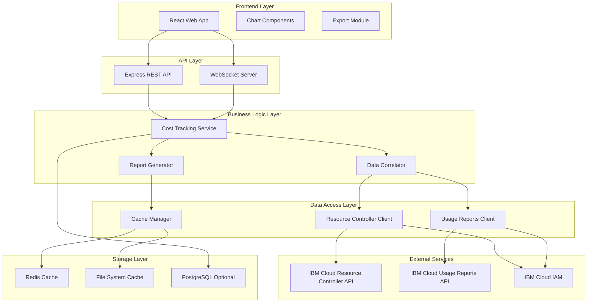
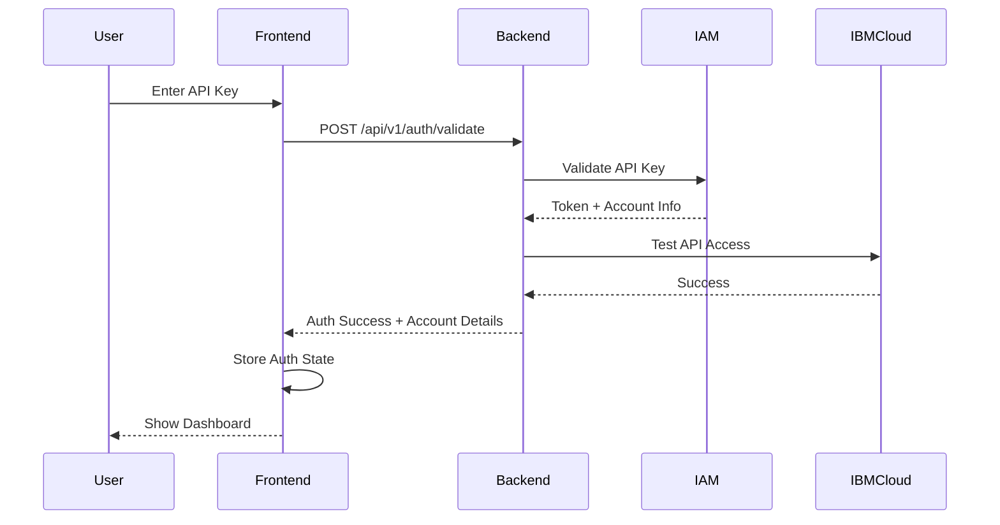

# IBM Cloud Cost Tracking System - Technical Specification

**Version:** 1.0  
**Date:** 2026-05-04  
**Status:** Draft for Review

---

## Table of Contents

1. [Executive Summary](#executive-summary)
2. [System Overview](#system-overview)
3. [Technology Stack](#technology-stack)
4. [Architecture Design](#architecture-design)
5. [Project Structure](#project-structure)
6. [Core Modules](#core-modules)
7. [API Design](#api-design)
8. [Data Models](#data-models)
9. [Authentication & Authorization](#authentication--authorization)
10. [Caching Strategy](#caching-strategy)
11. [Frontend Design](#frontend-design)
12. [Performance Considerations](#performance-considerations)
13. [Security Best Practices](#security-best-practices)
14. [Testing Strategy](#testing-strategy)
15. [Deployment Architecture](#deployment-architecture)
16. [Monitoring & Observability](#monitoring--observability)

---

## Executive Summary

### Purpose

This document provides a comprehensive technical specification for building a production-ready IBM Cloud Cost Tracking System that enables leaders to understand team members' IBM Cloud resource usage and view costs by user.

### Key Requirements

- **Robust & Production-Ready**: Enterprise-grade reliability with error handling, retry logic, and monitoring
- **Async Operations**: Non-blocking operations for optimal performance
- **DRY Principles**: Modular, reusable code with minimal duplication
- **Seamless IBM Cloud Integration**: Connect to any IBM Cloud account with user access
- **Visual Charts**: Interactive UI with data visualization
- **Export Capabilities**: Download charts for presentations (PowerPoint, PDF)

### Success Criteria

- System can handle 1000+ resources across multiple accounts
- Report generation completes in < 30 seconds for 6-month periods
- 99.9% uptime with proper error handling
- Cache hit rate > 80% for repeated queries
- Support for concurrent users (10+ simultaneous requests)

---

## System Overview

### High-Level Architecture



### Data Flow

1. **User Request**: User requests cost report via web UI
2. **Authentication**: System validates IBM Cloud API key
3. **Cache Check**: Check multi-layer cache for existing data
4. **Data Collection**: If cache miss, fetch from IBM Cloud APIs
5. **Data Correlation**: Match resources with costs and creators
6. **Report Generation**: Generate user-specific spending reports
7. **Visualization**: Render charts and tables in UI
8. **Export**: Allow download in multiple formats

---

## Technology Stack

### Backend

| Component | Technology | Version | Purpose |
|-----------|-----------|---------|---------|
| **Runtime** | Node.js | 18+ LTS | JavaScript runtime |
| **Framework** | Express.js | 4.18+ | REST API server |
| **Language** | TypeScript | 5.0+ | Type-safe development |
| **IBM Cloud SDKs** | @ibm-cloud/platform-services | 0.50+ | Resource Controller API |
| | @ibm-cloud/usage-reports | 5.0+ | Usage Reports API |
| | ibm-cloud-sdk-core | 4.0+ | Common SDK utilities |
| **Async Processing** | Bull | 4.11+ | Job queue for background tasks |
| **WebSocket** | Socket.io | 4.6+ | Real-time updates |
| **Validation** | Zod | 3.22+ | Schema validation |
| **Date Handling** | date-fns | 2.30+ | Date manipulation |
| **Logging** | Pino | 8.16+ | Structured logging |

### Frontend

| Component | Technology | Version | Purpose |
|-----------|-----------|---------|---------|
| **Framework** | React | 18.2+ | UI framework |
| **Build Tool** | Vite | 4.5+ | Fast build tool |
| **Language** | TypeScript | 5.0+ | Type-safe development |
| **State Management** | Zustand | 4.4+ | Lightweight state management |
| **Routing** | React Router | 6.20+ | Client-side routing |
| **UI Components** | shadcn/ui | Latest | Component library |
| **Styling** | Tailwind CSS | 3.3+ | Utility-first CSS |
| **Charts** | Recharts | 2.10+ | React charting library |
| **Tables** | TanStack Table | 8.10+ | Powerful data tables |
| **Export** | jsPDF | 2.5+ | PDF generation |
| | xlsx | 0.18+ | Excel export |
| **HTTP Client** | Axios | 1.6+ | API requests |
| **WebSocket Client** | Socket.io-client | 4.6+ | Real-time connection |

### Caching & Storage

| Component | Technology | Version | Purpose |
|-----------|-----------|---------|---------|
| **Memory Cache** | node-cache | 5.1+ | In-memory L1 cache |
| **Distributed Cache** | Redis | 7.0+ | Shared L2 cache (optional) |
| **File Cache** | File System | - | Persistent L2 cache |
| **Database** | PostgreSQL | 15+ | Optional persistent storage |
| **ORM** | Prisma | 5.0+ | Database access (if used) |

### DevOps & Tools

| Component | Technology | Version | Purpose |
|-----------|-----------|---------|---------|
| **Package Manager** | pnpm | 8.0+ | Fast, efficient package management |
| **Testing** | Vitest | 1.0+ | Unit testing |
| | Playwright | 1.40+ | E2E testing |
| **Linting** | ESLint | 8.0+ | Code quality |
| **Formatting** | Prettier | 3.0+ | Code formatting |
| **Git Hooks** | Husky | 8.0+ | Pre-commit hooks |
| **CI/CD** | GitHub Actions | - | Automated workflows |
| **Containerization** | Docker | 24.0+ | Container runtime |
| **Orchestration** | Docker Compose | 2.0+ | Local development |

---

## Architecture Design

### Layered Architecture

```
┌─────────────────────────────────────────────────────────┐
│                    Presentation Layer                    │
│  (React UI, Charts, Export Components)                  │
└─────────────────────────────────────────────────────────┘
                           ↓
┌─────────────────────────────────────────────────────────┐
│                      API Layer                           │
│  (Express Routes, WebSocket Handlers, Middleware)       │
└─────────────────────────────────────────────────────────┘
                           ↓
┌─────────────────────────────────────────────────────────┐
│                   Business Logic Layer                   │
│  (Services, Report Generation, Data Correlation)        │
└─────────────────────────────────────────────────────────┘
                           ↓
┌─────────────────────────────────────────────────────────┐
│                   Data Access Layer                      │
│  (IBM Cloud Clients, Cache Manager, Repository)         │
└─────────────────────────────────────────────────────────┘
                           ↓
┌─────────────────────────────────────────────────────────┐
│                    External Services                     │
│  (IBM Cloud APIs, Redis, PostgreSQL)                    │
└─────────────────────────────────────────────────────────┘
```

### Design Patterns

1. **Repository Pattern**: Abstract data access logic
2. **Factory Pattern**: Create SDK clients with proper configuration
3. **Strategy Pattern**: Different caching strategies (memory, file, Redis)
4. **Observer Pattern**: Real-time updates via WebSocket
5. **Singleton Pattern**: Shared cache and client instances
6. **Decorator Pattern**: Add retry logic, logging to API calls

---

## Project Structure

```
ibmcloud-cost-tracker/
├── backend/
│   ├── src/
│   │   ├── api/
│   │   │   ├── routes/
│   │   │   │   ├── auth.routes.ts
│   │   │   │   ├── reports.routes.ts
│   │   │   │   ├── resources.routes.ts
│   │   │   │   └── health.routes.ts
│   │   │   ├── middleware/
│   │   │   │   ├── auth.middleware.ts
│   │   │   │   ├── error.middleware.ts
│   │   │   │   ├── validation.middleware.ts
│   │   │   │   └── rate-limit.middleware.ts
│   │   │   └── controllers/
│   │   │       ├── reports.controller.ts
│   │   │       └── resources.controller.ts
│   │   ├── services/
│   │   │   ├── cost-tracking.service.ts
│   │   │   ├── report-generator.service.ts
│   │   │   ├── data-correlator.service.ts
│   │   │   └── export.service.ts
│   │   ├── clients/
│   │   │   ├── resource-controller.client.ts
│   │   │   ├── usage-reports.client.ts
│   │   │   └── client-factory.ts
│   │   ├── cache/
│   │   │   ├── cache-manager.ts
│   │   │   ├── memory-cache.ts
│   │   │   ├── file-cache.ts
│   │   │   ├── redis-cache.ts
│   │   │   └── cache-keys.ts
│   │   ├── models/
│   │   │   ├── resource.model.ts
│   │   │   ├── usage.model.ts
│   │   │   ├── report.model.ts
│   │   │   └── user.model.ts
│   │   ├── utils/
│   │   │   ├── logger.ts
│   │   │   ├── retry.ts
│   │   │   ├── rate-limiter.ts
│   │   │   ├── concurrent-fetcher.ts
│   │   │   └── date-utils.ts
│   │   ├── config/
│   │   │   ├── auth.config.ts
│   │   │   ├── cache.config.ts
│   │   │   ├── server.config.ts
│   │   │   └── ibm-cloud.config.ts
│   │   ├── types/
│   │   │   ├── api.types.ts
│   │   │   ├── ibm-cloud.types.ts
│   │   │   └── report.types.ts
│   │   ├── websocket/
│   │   │   ├── socket.handler.ts
│   │   │   └── events.ts
│   │   ├── jobs/
│   │   │   ├── report-generation.job.ts
│   │   │   └── cache-refresh.job.ts
│   │   └── server.ts
│   ├── tests/
│   │   ├── unit/
│   │   ├── integration/
│   │   └── e2e/
│   ├── package.json
│   ├── tsconfig.json
│   └── .env.example
├── frontend/
│   ├── src/
│   │   ├── components/
│   │   │   ├── charts/
│   │   │   │   ├── CostTrendChart.tsx
│   │   │   │   ├── CreatorPieChart.tsx
│   │   │   │   ├── ResourceTypeChart.tsx
│   │   │   │   └── MonthlyBreakdownChart.tsx
│   │   │   ├── tables/
│   │   │   │   ├── ResourceTable.tsx
│   │   │   │   └── CreatorTable.tsx
│   │   │   ├── export/
│   │   │   │   ├── ExportButton.tsx
│   │   │   │   └── ExportModal.tsx
│   │   │   ├── layout/
│   │   │   │   ├── Header.tsx
│   │   │   │   ├── Sidebar.tsx
│   │   │   │   └── Footer.tsx
│   │   │   └── ui/
│   │   │       └── (shadcn components)
│   │   ├── pages/
│   │   │   ├── Dashboard.tsx
│   │   │   ├── Reports.tsx
│   │   │   ├── Resources.tsx
│   │   │   └── Settings.tsx
│   │   ├── hooks/
│   │   │   ├── useReports.ts
│   │   │   ├── useResources.ts
│   │   │   ├── useWebSocket.ts
│   │   │   └── useExport.ts
│   │   ├── services/
│   │   │   ├── api.service.ts
│   │   │   ├── websocket.service.ts
│   │   │   └── export.service.ts
│   │   ├── store/
│   │   │   ├── reports.store.ts
│   │   │   ├── resources.store.ts
│   │   │   └── auth.store.ts
│   │   ├── types/
│   │   │   ├── api.types.ts
│   │   │   └── report.types.ts
│   │   ├── utils/
│   │   │   ├── formatters.ts
│   │   │   ├── validators.ts
│   │   │   └── chart-helpers.ts
│   │   ├── App.tsx
│   │   └── main.tsx
│   ├── public/
│   ├── package.json
│   ├── tsconfig.json
│   ├── vite.config.ts
│   └── tailwind.config.js
├── shared/
│   └── types/
│       └── common.types.ts
├── docker/
│   ├── Dockerfile.backend
│   ├── Dockerfile.frontend
│   └── docker-compose.yml
├── docs/
│   ├── USAGE_METERING_v2.md
│   ├── TECHNICAL_SPEC.md
│   ├── IMPLEMENTATION_ROADMAP.md
│   └── API.md
├── .github/
│   └── workflows/
│       ├── ci.yml
│       └── deploy.yml
├── .gitignore
├── README.md
└── package.json
```

---

*[Document continues in next section - see TECHNICAL_SPEC_PART2.md for remaining sections]*

## Core Modules

### 1. Authentication Manager

**Purpose**: Handle IBM Cloud authentication and token lifecycle

**Responsibilities**:
- Validate API keys
- Create IAM authenticators
- Manage token refresh
- Handle multiple account credentials

**Key Methods**:
```typescript
class AuthManager {
  validateApiKey(apiKey: string): boolean
  createAuthenticator(apiKey: string): IamAuthenticator
  refreshToken(): Promise<void>
  getAccountId(): string
}
```

### 2. SDK Client Factory

**Purpose**: Initialize and configure IBM Cloud SDK clients

**Responsibilities**:
- Create Resource Controller clients
- Create Usage Reports clients
- Configure retry logic and timeouts
- Pool client instances for reuse

**Key Methods**:
```typescript
class ClientFactory {
  createResourceControllerClient(config: ClientConfig): ResourceControllerClient
  createUsageReportsClient(config: ClientConfig): UsageReportsClient
  configureRetries(client: any, options: RetryOptions): void
}
```

### 3. Resource Collector

**Purpose**: Retrieve resources from IBM Cloud Resource Controller

**Responsibilities**:
- Fetch all resource instances with pagination
- Filter by resource group
- Handle rate limiting
- Provide progress callbacks

**Key Methods**:
```typescript
class ResourceCollector {
  getAllResources(accountId: string, options?: CollectionOptions): Promise<Resource[]>
  getResourcesByGroup(accountId: string, groupId: string): Promise<Resource[]>
  streamResources(accountId: string, callback: ProgressCallback): AsyncIterator<Resource>
}
```

### 4. Usage Collector

**Purpose**: Fetch cost data from Usage Reports API

**Responsibilities**:
- Get account usage summaries
- Fetch resource-level usage data
- Handle date range queries
- Aggregate multi-month data

**Key Methods**:
```typescript
class UsageCollector {
  getAccountUsage(accountId: string, month: string): Promise<AccountUsage>
  getResourceUsage(accountId: string, month: string): Promise<ResourceUsage[]>
  getUsageForRange(accountId: string, startMonth: string, endMonth: string): Promise<UsageData>
}
```

### 5. Data Correlator

**Purpose**: Match resources with costs and creators

**Responsibilities**:
- Correlate resources with usage data
- Extract creator information
- Calculate total costs
- Generate monthly breakdowns

**Key Methods**:
```typescript
class DataCorrelator {
  correlateData(resources: Resource[], usage: UsageData): Promise<CorrelatedData>
  matchResourceToUsage(resource: Resource, usageMap: Map<string, Usage[]>): CorrelatedResource
  extractCreatorEmail(createdBy: string | object): string
  generateStatistics(correlatedData: CorrelatedData): Statistics
}
```

### 6. Cache Manager

**Purpose**: Multi-layer caching with deduplication

**Responsibilities**:
- L1: Memory cache (fast, volatile)
- L2: File/Redis cache (persistent)
- Request deduplication
- Cache invalidation
- TTL management

**Key Methods**:
```typescript
class CacheManager {
  get<T>(key: string, fetchFn: () => Promise<T>, options?: CacheOptions): Promise<T>
  set(key: string, value: any, ttl?: number): Promise<void>
  invalidate(key: string): Promise<void>
  getStats(): CacheStats
}
```

### 7. Report Generator

**Purpose**: Generate user-specific spending reports

**Responsibilities**:
- Group costs by creator
- Calculate aggregations
- Generate trend reports
- Export to multiple formats

**Key Methods**:
```typescript
class ReportGenerator {
  generateCreatorReport(data: CorrelatedData, options?: ReportOptions): CreatorReport
  generateTrendReport(data: CorrelatedData): TrendReport
  generateResourceTypeReport(data: CorrelatedData): ResourceTypeReport
  exportToJSON(report: Report): string
  exportToCSV(report: Report): string
}
```

### 8. Export Service

**Purpose**: Export reports and charts for presentations

**Responsibilities**:
- Generate PDF reports
- Export to Excel
- Create PowerPoint slides
- Export chart images

**Key Methods**:
```typescript
class ExportService {
  exportToPDF(report: Report, charts: Chart[]): Promise<Buffer>
  exportToExcel(report: Report): Promise<Buffer>
  exportToPowerPoint(report: Report, charts: Chart[]): Promise<Buffer>
  exportChartAsImage(chart: Chart, format: 'png' | 'svg'): Promise<Buffer>
}
```

---

## API Design

### REST API Endpoints

#### Authentication

```
POST   /api/v1/auth/validate
  Request:  { apiKey: string, accountId?: string }
  Response: { valid: boolean, accountId: string, accountName: string }
```

#### Resources

```
GET    /api/v1/resources
  Query:    ?accountId=xxx&resourceGroupId=xxx&refresh=false
  Response: { resources: Resource[], count: number, cachedAt: string }

GET    /api/v1/resources/:resourceId
  Response: { resource: Resource, usage: Usage[] }
```

#### Reports

```
POST   /api/v1/reports/generate
  Request:  { 
    accountId: string,
    startMonth: string,
    endMonth: string,
    filters?: ReportFilters
  }
  Response: { 
    reportId: string,
    status: 'pending' | 'processing' | 'completed',
    estimatedTime: number
  }

GET    /api/v1/reports/:reportId
  Response: { 
    report: Report,
    status: 'completed',
    generatedAt: string
  }

GET    /api/v1/reports/:reportId/export
  Query:    ?format=pdf|excel|pptx|csv
  Response: Binary file download
```

#### Usage

```
GET    /api/v1/usage/account/:accountId
  Query:    ?month=2026-01
  Response: { accountUsage: AccountUsage }

GET    /api/v1/usage/resources/:accountId
  Query:    ?startMonth=2026-01&endMonth=2026-04
  Response: { resourceUsage: ResourceUsage[] }
```

#### Health & Metrics

```
GET    /api/v1/health
  Response: { status: 'healthy', uptime: number, version: string }

GET    /api/v1/metrics
  Response: { 
    requests: number,
    cacheHitRate: number,
    avgResponseTime: number
  }
```

### WebSocket Events

#### Client → Server

```typescript
// Request report generation with real-time updates
socket.emit('report:generate', {
  accountId: string,
  startMonth: string,
  endMonth: string
})

// Subscribe to report updates
socket.emit('report:subscribe', { reportId: string })
```

#### Server → Client

```typescript
// Report generation progress
socket.on('report:progress', {
  reportId: string,
  stage: 'resources' | 'usage' | 'correlation' | 'generation',
  progress: number,
  message: string
})

// Report completed
socket.on('report:completed', {
  reportId: string,
  report: Report
})

// Error occurred
socket.on('report:error', {
  reportId: string,
  error: string
})
```

### Request/Response Formats

#### Standard Response Envelope

```typescript
interface ApiResponse<T> {
  success: boolean
  data?: T
  error?: {
    code: string
    message: string
    details?: any
  }
  meta?: {
    timestamp: string
    requestId: string
    cached: boolean
  }
}
```

#### Pagination

```typescript
interface PaginatedResponse<T> {
  data: T[]
  pagination: {
    page: number
    limit: number
    total: number
    hasMore: boolean
  }
}
```

---

## Data Models

### Resource Model

```typescript
interface Resource {
  id: string
  name: string
  type: string
  resourceId: string
  resourceGroupId: string
  resourceGroupName: string
  accountId: string
  createdAt: string
  createdBy: string
  state: 'active' | 'inactive' | 'removed'
  region: string
  tags: string[]
  metadata: Record<string, any>
}
```

### Usage Model

```typescript
interface Usage {
  resourceInstanceId: string
  resourceInstanceName: string
  billingMonth: string
  planId: string
  planName: string
  pricingRegion: string
  pricingPlanId: string
  billableCost: number
  nonBillableCost: number
  currency: string
  usages: UsageMetric[]
}

interface UsageMetric {
  metric: string
  quantity: number
  ratableQuantity: number
  cost: number
  unit: string
}
```

### Correlated Resource Model

```typescript
interface CorrelatedResource extends Resource {
  usage: Usage[]
  totalCost: number
  monthlyBreakdown: Record<string, number>
  creatorEmail: string
  costByMetric: Record<string, number>
}
```

### Report Models

```typescript
interface CreatorReport {
  generatedAt: string
  dateRange: {
    startMonth: string
    endMonth: string
  }
  creators: Record<string, CreatorData>
  summary: {
    totalCost: number
    totalResources: number
    totalCreators: number
  }
  topCreators: TopCreator[]
}

interface CreatorData {
  email: string
  resources: ResourceSummary[]
  totalCost: number
  resourceCount: number
  byResourceType: Record<string, TypeAggregate>
  byMonth: Record<string, number>
}

interface TrendReport {
  generatedAt: string
  trends: MonthlyTrend[]
  summary: {
    totalMonths: number
    averageMonthlyCost: number
    highestMonth: MonthlyTrend
    lowestMonth: MonthlyTrend
  }
}

interface MonthlyTrend {
  month: string
  totalCost: number
  resourceCount: number
  creators: number
  growth: number
}
```

---

## Authentication & Authorization

### Authentication Flow



### Security Model

1. **API Key Storage**:
   - Backend: Environment variables only
   - Frontend: Never store API keys
   - Use session tokens for frontend auth

2. **Token Management**:
   - IAM tokens auto-refresh before expiry
   - Token caching with secure storage
   - Automatic retry on 401 errors

3. **Access Control**:
   - Account-level isolation
   - Resource group filtering
   - Role-based permissions (future)

### Environment Variables

```bash
# Backend .env
IBM_CLOUD_API_KEY=your-api-key-here
IBM_CLOUD_ACCOUNT_ID=your-account-id
IBM_CLOUD_REGION=us-south

# Security
SESSION_SECRET=random-secret-key
JWT_SECRET=jwt-signing-key
CORS_ORIGIN=http://localhost:5173

# Cache
REDIS_URL=redis://localhost:6379
CACHE_MEMORY_TTL=300
CACHE_FILE_TTL=3600

# Performance
MAX_CONCURRENT_REQUESTS=10
RATE_LIMIT_RPS=20
REQUEST_TIMEOUT=60000
```

---

## Caching Strategy

### Multi-Layer Cache Architecture

```
┌─────────────────────────────────────────────────────┐
│                   Request Layer                      │
└─────────────────────────────────────────────────────┘
                        ↓
┌─────────────────────────────────────────────────────┐
│              L1: Memory Cache (node-cache)           │
│  • TTL: 5 minutes                                    │
│  • Size: 1000 keys max                               │
│  • Hit Rate: ~60%                                    │
└─────────────────────────────────────────────────────┘
                        ↓ (on miss)
┌─────────────────────────────────────────────────────┐
│         L2: Redis/File Cache (persistent)            │
│  • TTL: 1 hour                                       │
│  • Size: Unlimited                                   │
│  • Hit Rate: ~30%                                    │
└─────────────────────────────────────────────────────┘
                        ↓ (on miss)
┌─────────────────────────────────────────────────────┐
│              Fetch from IBM Cloud APIs               │
│  • Cache result in both layers                       │
└─────────────────────────────────────────────────────┘
```

### Cache Key Strategy

```typescript
// Resource collection
resources:{accountId}
resources:{accountId}:rg:{resourceGroupId}

// Usage data
usage:{accountId}:{month}
usage:{accountId}:{startMonth}:{endMonth}

// Correlated data
correlated:{accountId}:{startMonth}:{endMonth}

// Reports
report:{reportId}
report:{accountId}:{type}:{startMonth}:{endMonth}
```

### Cache Invalidation Rules

1. **Time-based**: Automatic expiry via TTL
2. **Event-based**: Invalidate on resource changes
3. **Manual**: Admin-triggered cache clear
4. **Selective**: Invalidate specific account/month data

### Request Deduplication

```typescript
// Prevent duplicate concurrent requests
class CacheManager {
  private pendingRequests = new Map<string, Promise<any>>()
  
  async get<T>(key: string, fetchFn: () => Promise<T>): Promise<T> {
    // If request already in flight, return same promise
    if (this.pendingRequests.has(key)) {
      return this.pendingRequests.get(key)
    }
    
    // Check cache layers
    const cached = await this.checkCacheLayers(key)
    if (cached) return cached
    
    // Fetch and deduplicate
    const promise = fetchFn()
    this.pendingRequests.set(key, promise)
    
    try {
      const result = await promise
      await this.setCacheLayers(key, result)
      return result
    } finally {
      this.pendingRequests.delete(key)
    }
  }
}
```

---

## Frontend Design

### UI/UX Requirements

#### Dashboard Page

**Layout**:
- Header with account selector and date range picker
- Summary cards (Total Cost, Resources, Creators, Trend)
- Main chart area with tabs (Trends, Creators, Resource Types)
- Top creators table
- Recent activity feed

**Charts**:
1. **Cost Trend Chart** (Line Chart)
   - X-axis: Months
   - Y-axis: Cost ($)
   - Multiple lines for different creators (top 5)
   - Tooltip with detailed breakdown

2. **Creator Distribution** (Pie Chart)
   - Segments: Top 10 creators
   - "Others" segment for remaining
   - Click to filter/drill down

3. **Resource Type Breakdown** (Bar Chart)
   - X-axis: Resource types
   - Y-axis: Cost ($)
   - Stacked by creator
   - Sortable

4. **Monthly Comparison** (Grouped Bar Chart)
   - Compare current vs previous period
   - Show growth percentage
   - Highlight anomalies

#### Reports Page

**Features**:
- Generate custom reports with filters
- Save report configurations
- Schedule recurring reports
- View report history
- Export options

**Filters**:
- Date range (start/end month)
- Creators (multi-select)
- Resource types (multi-select)
- Resource groups (multi-select)
- Cost threshold (min/max)

#### Resources Page

**Features**:
- Searchable, sortable table
- Columns: Name, Type, Creator, Cost, Created Date, Status
- Inline cost breakdown
- Bulk actions
- Export to CSV/Excel

#### Settings Page

**Features**:
- API key management
- Account configuration
- Cache settings
- Export preferences
- Notification settings

### Chart Export Capabilities

```typescript
interface ExportOptions {
  format: 'png' | 'svg' | 'pdf' | 'pptx'
  resolution: 'low' | 'medium' | 'high'
  includeData: boolean
  theme: 'light' | 'dark'
}

// Export single chart
exportChart(chartId: string, options: ExportOptions): Promise<Blob>

// Export dashboard
exportDashboard(options: ExportOptions): Promise<Blob>

// Generate PowerPoint
generatePresentation(slides: Slide[]): Promise<Blob>
```

### Responsive Design

- **Desktop**: Full dashboard with all charts
- **Tablet**: Stacked layout, simplified charts
- **Mobile**: Card-based layout, essential metrics only

### Accessibility

- WCAG 2.1 Level AA compliance
- Keyboard navigation
- Screen reader support
- High contrast mode
- Configurable font sizes

---

## Performance Considerations

### Backend Optimizations

1. **Concurrent Data Fetching**:
   ```typescript
   // Fetch resources and usage in parallel
   const [resources, usage] = await Promise.all([
     resourceCollector.getAllResources(accountId),
     usageCollector.getUsageForRange(accountId, startMonth, endMonth)
   ])
   ```

2. **Pagination**:
   - Automatic pagination for large datasets
   - Configurable page size (default: 100)
   - Cursor-based pagination for consistency

3. **Rate Limiting**:
   - Token bucket algorithm
   - 20 requests/second default
   - Automatic backoff on 429 errors

4. **Connection Pooling**:
   - Reuse SDK client instances
   - HTTP keep-alive enabled
   - Connection timeout: 60s

5. **Streaming**:
   - Stream large datasets to avoid memory issues
   - Use async iterators for processing
   - Backpressure handling

### Frontend Optimizations

1. **Code Splitting**:
   - Route-based splitting
   - Lazy load chart libraries
   - Dynamic imports for heavy components

2. **Virtual Scrolling**:
   - Use TanStack Virtual for large tables
   - Render only visible rows
   - Smooth scrolling performance

3. **Memoization**:
   - React.memo for expensive components
   - useMemo for computed values
   - useCallback for event handlers

4. **Debouncing**:
   - Search inputs (300ms)
   - Filter changes (500ms)
   - Window resize (200ms)

5. **Progressive Loading**:
   - Show skeleton screens
   - Load critical data first
   - Lazy load secondary data

### Performance Targets

| Metric | Target | Measurement |
|--------|--------|-------------|
| **API Response Time** | < 2s (p95) | Server-side timing |
| **Report Generation** | < 30s (6 months) | End-to-end timing |
| **Cache Hit Rate** | > 80% | Cache statistics |
| **Page Load Time** | < 3s (FCP) | Lighthouse |
| **Time to Interactive** | < 5s | Lighthouse |
| **Bundle Size** | < 500KB (gzipped) | Webpack analyzer |

---

## Security Best Practices

### API Security

1. **Authentication**:
   - API key validation on every request
   - Token expiry checking
   - Automatic token refresh

2. **Authorization**:
   - Account-level access control
   - Resource group filtering
   - Audit logging

3. **Input Validation**:
   - Zod schema validation
   - Sanitize user inputs
   - Prevent injection attacks

4. **Rate Limiting**:
   - Per-IP rate limiting
   - Per-account rate limiting
   - Exponential backoff

5. **CORS**:
   - Whitelist allowed origins
   - Credentials handling
   - Preflight caching

### Data Security

1. **Encryption**:
   - TLS 1.3 for all connections
   - Encrypt sensitive data at rest
   - Secure session storage

2. **Secrets Management**:
   - Never commit secrets to git
   - Use environment variables
   - Rotate keys regularly (90 days)

3. **Logging**:
   - Never log API keys or tokens
   - Redact sensitive information
   - Structured logging with Pino

4. **Error Handling**:
   - Generic error messages to clients
   - Detailed logs server-side
   - No stack traces in production

### Compliance

1. **Data Privacy**:
   - GDPR compliance considerations
   - Data retention policies
   - User data export/deletion

2. **Audit Trail**:
   - Log all API access
   - Track report generation
   - Monitor unusual activity

---

## Testing Strategy

### Unit Tests

**Coverage Target**: 80%+

**Test Framework**: Vitest

**Areas**:
- All service methods
- Data correlation logic
- Cache manager operations
- Utility functions
- API route handlers

**Example**:
```typescript
describe('DataCorrelator', () => {
  it('should correlate resources with usage data', async () => {
    const correlator = new DataCorrelator()
    const resources = [mockResource]
    const usage = mockUsageData
    
    const result = await correlator.correlateData(resources, usage)
    
    expect(result.resources).toHaveLength(1)
    expect(result.resources[0].totalCost).toBeGreaterThan(0)
  })
})
```

### Integration Tests

**Test Framework**: Vitest + Supertest

**Areas**:
- API endpoint flows
- Database operations
- Cache integration
- External API mocking

**Example**:
```typescript
describe('Reports API', () => {
  it('should generate a report', async () => {
    const response = await request(app)
      .post('/api/v1/reports/generate')
      .send({
        accountId: 'test-account',
        startMonth: '2026-01',
        endMonth: '2026-04'
      })
      .expect(200)
    
    expect(response.body.reportId).toBeDefined()
  })
})
```

### E2E Tests

**Test Framework**: Playwright

**Scenarios**:
- User authentication flow
- Report generation and viewing
- Chart interactions
- Export functionality
- Error handling

**Example**:
```typescript
test('generate and view report', async ({ page }) => {
  await page.goto('/')
  await page.fill('[data-testid="api-key"]', 'test-key')
  await page.click('[data-testid="validate"]')
  
  await page.click('[data-testid="generate-report"]')
  await page.waitForSelector('[data-testid="report-chart"]')
  
  expect(await page.textContent('[data-testid="total-cost"]')).toContain('$')
})
```

### Performance Tests

**Tool**: k6

**Scenarios**:
- Load testing (100 concurrent users)
- Stress testing (find breaking point)
- Spike testing (sudden traffic increase)
- Endurance testing (sustained load)

---

## Deployment Architecture

### Container Architecture

```yaml
# docker-compose.yml
version: '3.8'

services:
  backend:
    build: ./backend
    ports:
      - "3000:3000"
    environment:
      - NODE_ENV=production
      - REDIS_URL=redis://redis:6379
    depends_on:
      - redis
    volumes:
      - ./cache:/app/cache
    restart: unless-stopped

  frontend:
    build: ./frontend
    ports:
      - "80:80"
    depends_on:
      - backend
    restart: unless-stopped

  redis:
    image: redis:7-alpine
    ports:
      - "6379:6379"
    volumes:
      - redis-data:/data
    restart: unless-stopped

volumes:
  redis-data:
```

### CI/CD Pipeline

```yaml
# .github/workflows/ci.yml
name: CI/CD Pipeline

on:
  push:
    branches: [main, develop]
  pull_request:
    branches: [main]

jobs:
  test:
    runs-on: ubuntu-latest
    steps:
      - uses: actions/checkout@v3
      - uses: actions/setup-node@v3
        with:
          node-version: '18'
      - run: pnpm install
      - run: pnpm test
      - run: pnpm test:e2e

  build:
    needs: test
    runs-on: ubuntu-latest
    steps:
      - uses: actions/checkout@v3
      - uses: docker/build-push-action@v4
        with:
          context: .
          push: true
          tags: cost-tracker:${{ github.sha }}
```

---

## Monitoring & Observability

### Logging Strategy

**Structured Logging with Pino**:
```typescript
logger.info({
  event: 'report_generated',
  reportId: 'abc123',
  accountId: 'account-456',
  duration: 15000,
  resourceCount: 250
}, 'Report generation completed')
```

**Log Levels**:
- **ERROR**: System errors, API failures
- **WARN**: Degraded performance, retry attempts
- **INFO**: Business events, API calls
- **DEBUG**: Detailed debugging information

### Metrics Collection

**Key Metrics**:
```typescript
interface Metrics {
  // Request metrics
  totalRequests: number
  requestsPerSecond: number
  avgResponseTime: number
  errorRate: number
  
  // Cache metrics
  cacheHitRate: number
  cacheSize: number
  cacheEvictions: number
  
  // Business metrics
  reportsGenerated: number
  avgReportGenerationTime: number
  activeUsers: number
  
  // Resource metrics
  cpuUsage: number
  memoryUsage: number
  diskUsage: number
}
```

### Health Checks

```typescript
// Health check endpoint
app.get('/api/v1/health', async (req, res) => {
  const health = {
    status: 'healthy',
    timestamp: new Date().toISOString(),
    uptime: process.uptime(),
    checks: {
      ibmCloud: await checkIBMCloudConnection(),
      redis: await checkRedisConnection(),
      database: await checkDatabaseConnection()
    }
  }
  
  const isHealthy = Object.values(health.checks).every(c => c.status === 'ok')
  res.status(isHealthy ? 200 : 503).json(health)
})
```

### Alerting Rules

1. **Critical Alerts**:
   - API error rate > 5%
   - Response time > 10s (p95)
   - Service down
   - Cache failure

2. **Warning Alerts**:
   - API error rate > 2%
   - Response time > 5s (p95)
   - Cache hit rate < 60%
   - High memory usage (> 80%)

---

## Conclusion

This technical specification provides a comprehensive blueprint for building a production-ready IBM Cloud Cost Tracking System. The architecture emphasizes:

- **Scalability**: Multi-layer caching, async processing, efficient data fetching
- **Reliability**: Retry logic, error handling, health monitoring
- **Maintainability**: Modular design, TypeScript, comprehensive testing
- **User Experience**: Interactive charts, real-time updates, multiple export formats
- **Security**: API key management, input validation, audit logging

### Next Steps

Refer to [`IMPLEMENTATION_ROADMAP.md`](./IMPLEMENTATION_ROADMAP.md) for the phased implementation plan with detailed tasks, dependencies, and timelines.

---

**Document Version**: 1.0  
**Last Updated**: 2026-05-04  
**Status**: Ready for Implementation