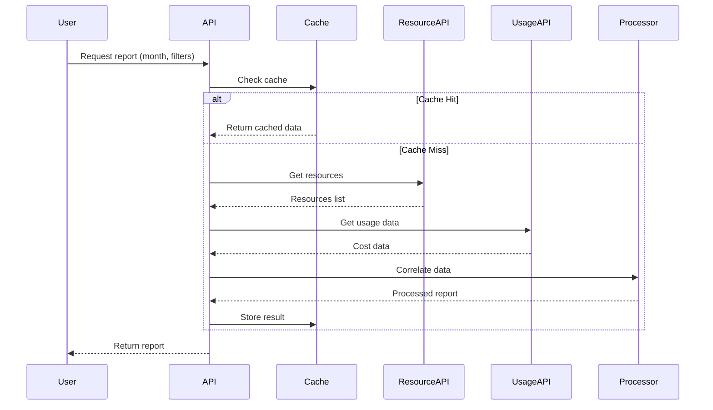
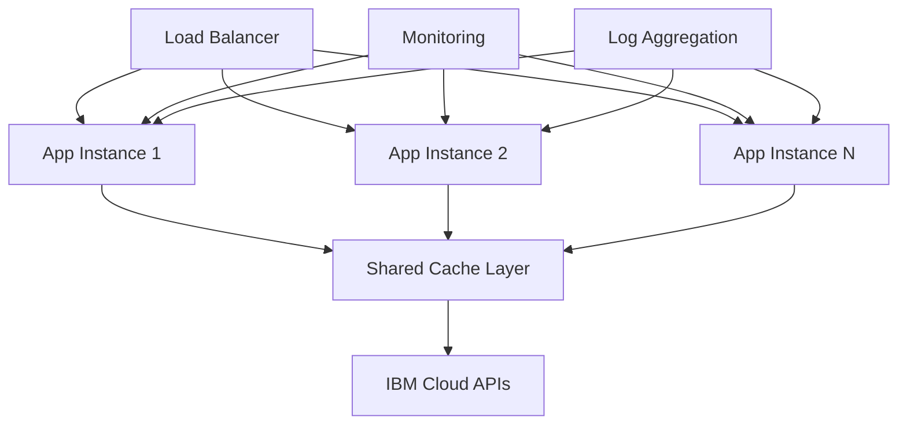

# IBM Cloud Cost Tracking System - SDK Implementation Guide

**Version:** 2.0  
**Date:** 2026-05-01  
**Purpose:** Comprehensive guide for implementing IBM Cloud cost tracking using Node.js SDKs

---

## Table of Contents

1. [Executive Summary](#executive-summary)
2. [Architecture Overview](#architecture-overview)
3. [Authentication Strategy](#authentication-strategy)
4. [SDK Implementation](#sdk-implementation)
5. [Data Collection & Processing](#data-collection--processing)
6. [Caching Architecture](#caching-architecture)
7. [Performance & Scalability](#performance--scalability)
8. [Code Examples](#code-examples)
9. [Operational Considerations](#operational-considerations)
10. [Appendix](#appendix)

---

## Executive Summary

### What This Guide Covers

This document provides a complete implementation blueprint for building an IBM Cloud cost tracking system using Node.js that:

- **Retrieves all resources** within an organization using IBM Cloud Resource Controller APIs
- **Calculates per-resource costs** for specified date ranges using IBM Cloud Usage Reports APIs  @https://cloud.ibm.com/apidocs/resource-controller/resource-controller#get-resource-instance
- **Correlates creators** with resources to generate spending reports by user
- **Supports concurrent multi-user access** with intelligent caching
- **Metering reporting** with @https://cloud.ibm.com/apidocs/metering-reporting?code=node 
- **Scales efficiently** for production workloads

### Key Technologies

- **@ibm-cloud/platform-services** - Resource Controller SDK
- **@ibm-cloud/usage-reports** - Usage Metering and Reporting SDK
- **IBM Cloud IAM** - Authentication and authorization
- **Node.js 18+** - Runtime environment

### Implementation Approach

This guide focuses on **programmatic SDK access** rather than CLI commands, providing:
- Direct API control with better error handling
- Token-based authentication with automatic refresh
- Efficient pagination and rate limiting
- Modular, reusable architecture
- Production-ready caching layer

---

## Architecture Overview

### System Components

```mermaid
graph TB
    A[Client Application] --> B[Authentication Manager]
    B --> C[SDK Client Factory]
    C --> D[Resource Controller Client]
    C --> E[Usage Reports Client]
    D --> F[Cache Layer]
    E --> F
    F --> G[Data Processor]
    G --> H[Report Generator]
    
    B -.-> I[IAM Token Service]
    D -.-> J[IBM Cloud Resource Controller API]
    E -.-> K[IBM Cloud Usage Reports API]
```



### Core Modules

| Module | Responsibility | Key Features |
|--------|---------------|--------------|
| **AuthManager** | Handle authentication and token lifecycle | API key management, token refresh, credential validation |
| **SDKClientFactory** | Initialize and configure SDK clients | Client pooling, configuration management, error handling |
| **ResourceCollector** | Retrieve resources from Resource Controller | Pagination, filtering, retry logic |
| **UsageCollector** | Fetch cost data from Usage Reports API | Date range handling, aggregation, rate limiting |
| **DataCorrelator** | Match resources with costs and creators | Efficient lookups, data transformation |
| **CacheManager** | Store and retrieve cached data | TTL management, invalidation, deduplication |
| **ReportGenerator** | Generate user-specific spending reports | Filtering, grouping, export formats |

### Data Flow



---

## Authentication Strategy

### Overview

IBM Cloud SDKs support multiple authentication methods. This guide focuses on **API key-based authentication** with IAM token management for production use.

### Authentication Methods Comparison

| Method | Use Case | Pros | Cons |
|--------|----------|------|------|
| **API Key** | Production, automation | Programmatic, long-lived, revocable | Requires secure storage |
| **IAM Token** | Short-lived operations | Direct control, no key storage | Manual refresh needed |
| **Trusted Profile** | Service-to-service | No credentials in code | Complex setup |
| **Bearer Token** | External auth systems | Integration flexibility | Token management overhead |

### Recommended: API Key with Automatic Token Refresh

#### Security Best Practices

**✅ DO:**
- Store API keys in environment variables (`.env` files)
- Use separate API keys per environment (dev, staging, prod)
- Implement key rotation schedule (90 days)
- Use service IDs for production deployments
- Encrypt `.env` files in version control (if necessary)
- Limit API key permissions to minimum required (Viewer role for billing)

**❌ DON'T:**
- Hardcode API keys in source code
- Commit API keys to version control
- Share API keys across multiple applications
- Use personal API keys for shared services
- Log API keys or tokens in application logs

### Creating an API Key

#### Via IBM Cloud Console

```bash
1. Navigate to: https://cloud.ibm.com/iam/apikeys
2. Click "Create an IBM Cloud API key"
3. Name: "cost-tracking-production"
4. Description: "API key for cost tracking system"
5. Click "Create"
6. Copy the key immediately (shown only once)
7. Store securely in password manager or secrets vault
```

#### Via IBM Cloud CLI

```bash
# Create API key
ibmcloud iam api-key-create cost-tracking-prod \
  --description "Production API key for cost tracking" \
  --file api-key.json

# View the key
cat api-key.json

# Store in environment variable
export IBM_CLOUD_API_KEY=$(cat api-key.json | jq -r .apikey)
```

### Environment Configuration

#### .env File Structure

```bash
# .env
# IBM Cloud Authentication
IBM_CLOUD_API_KEY=your-api-key-here

# Optional: Specify account ID (if managing multiple accounts)
IBM_CLOUD_ACCOUNT_ID=your-account-id

# Optional: Specify region
IBM_CLOUD_REGION=us-south

# Optional: Custom IAM endpoint
IBM_CLOUD_IAM_URL=https://iam.cloud.ibm.com

# Optional: Custom service endpoints
RESOURCE_CONTROLLER_URL=https://resource-controller.cloud.ibm.com
USAGE_REPORTS_URL=https://billing.cloud.ibm.com
```

---

*[Document continues in next section...]*

## SDK Implementation Details

### Required Dependencies

```bash
# Core IBM Cloud SDKs
npm install @ibm-cloud/platform-services@^0.50.0
npm install @ibm-cloud/usage-reports@^5.0.0
npm install ibm-cloud-sdk-core@^4.0.0

# Supporting libraries
npm install dotenv@^16.3.1
npm install date-fns@^2.30.0
npm install node-cache@^5.1.2
npm install pino@^8.16.0
```

### Authentication Configuration Module

```javascript
// src/config/auth.js
import dotenv from 'dotenv';
import { IamAuthenticator } from 'ibm-cloud-sdk-core';

dotenv.config();

export class AuthConfig {
  constructor() {
    this.apiKey = process.env.IBM_CLOUD_API_KEY;
    this.accountId = process.env.IBM_CLOUD_ACCOUNT_ID;
    this.region = process.env.IBM_CLOUD_REGION || 'us-south';
    this.iamUrl = process.env.IBM_CLOUD_IAM_URL;
    
    this.validate();
  }
  
  validate() {
    if (!this.apiKey) {
      throw new Error(
        'IBM_CLOUD_API_KEY not found. Set it in .env file.'
      );
    }
    
    if (!this.apiKey.match(/^[A-Za-z0-9_-]{40,}$/)) {
      throw new Error('Invalid API key format');
    }
  }
  
  createAuthenticator() {
    const config = { apikey: this.apiKey };
    if (this.iamUrl) config.url = this.iamUrl;
    return new IamAuthenticator(config);
  }
}
```

### Resource Controller Client

```javascript
// src/clients/resource-controller-client.js
import { ResourceControllerV2 } from '@ibm-cloud/platform-services';
import { IamAuthenticator } from 'ibm-cloud-sdk-core';

export class ResourceControllerClient {
  constructor(apiKey, options = {}) {
    this.authenticator = new IamAuthenticator({ apikey: apiKey });
    
    this.client = new ResourceControllerV2({
      authenticator: this.authenticator,
      serviceUrl: options.serviceUrl || ResourceControllerV2.DEFAULT_SERVICE_URL
    });
    
    this.client.setEnableRetries(true);
    this.client.setMaxRetries(options.maxRetries || 3);
    this.client.setTimeout(options.timeout || 60000);
  }
  
  /**
   * Get all resource instances with automatic pagination
   */
  async getAllResourceInstances(accountId, options = {}) {
    const instances = [];
    let start = null;
    
    do {
      const params = {
        accountId,
        limit: options.limit || 100,
        ...(start && { start })
      };
      
      if (options.resourceGroupId) {
        params.resourceGroupId = options.resourceGroupId;
      }
      
      const response = await this.client.listResourceInstances(params);
      const { resources, next_url } = response.result;
      
      instances.push(...resources);
      start = this.extractStartToken(next_url);
      
      if (options.onProgress) {
        options.onProgress(instances.length);
      }
    } while (start);
    
    return instances;
  }
  
  extractStartToken(nextUrl) {
    if (!nextUrl) return null;
    const url = new URL(nextUrl);
    return url.searchParams.get('start');
  }
}
```

### Usage Reports Client

```javascript
// src/clients/usage-reports-client.js
import { UsageReportsV4 } from '@ibm-cloud/usage-reports';
import { IamAuthenticator } from 'ibm-cloud-sdk-core';

export class UsageReportsClient {
  constructor(apiKey, options = {}) {
    this.authenticator = new IamAuthenticator({ apikey: apiKey });
    
    this.client = new UsageReportsV4({
      authenticator: this.authenticator,
      serviceUrl: options.serviceUrl || UsageReportsV4.DEFAULT_SERVICE_URL
    });
    
    this.client.setEnableRetries(true);
    this.client.setMaxRetries(options.maxRetries || 3);
  }
  
  /**
   * Get account usage summary
   */
  async getAccountUsage(accountId, month) {
    const response = await this.client.getAccountUsage({
      accountId,
      billingmonth: month,
      names: true
    });
    return response.result;
  }
  
  /**
   * Get resource usage with pagination
   */
  async getResourceUsage(accountId, month, options = {}) {
    const usageRecords = [];
    let offset = 0;
    const limit = options.limit || 100;
    
    while (true) {
      const response = await this.client.getResourceUsageAccount({
        accountId,
        billingmonth: month,
        names: true,
        limit,
        offset
      });
      
      const { resources, count } = response.result;
      usageRecords.push(...resources);
      
      if (usageRecords.length >= count) break;
      offset += limit;
    }
    
    return usageRecords;
  }
}
```

---

## Caching Architecture

### Multi-Layer Cache Strategy

```javascript
// src/cache/cache-manager.js
import NodeCache from 'node-cache';
import fs from 'fs/promises';
import path from 'path';
import crypto from 'crypto';

export class CacheManager {
  constructor(options = {}) {
    // Memory cache (L1)
    this.memoryCache = new NodeCache({
      stdTTL: options.memoryTTL || 300,
      checkperiod: 60,
      useClones: false,
      maxKeys: 1000
    });
    
    // File cache (L2)
    this.fileCacheDir = options.fileCacheDir || './cache';
    this.fileCacheTTL = options.fileCacheTTL || 3600;
    
    // Request deduplication
    this.pendingRequests = new Map();
    
    this.init();
  }
  
  async init() {
    await fs.mkdir(this.fileCacheDir, { recursive: true });
  }
  
  /**
   * Get with fallback chain: Memory -> File -> Fetch
   */
  async get(key, fetchFunction, options = {}) {
    const cacheKey = this.generateCacheKey(key);
    
    // Deduplicate concurrent requests
    if (this.pendingRequests.has(cacheKey)) {
      return await this.pendingRequests.get(cacheKey);
    }
    
    // Try memory cache
    const memoryResult = this.memoryCache.get(cacheKey);
    if (memoryResult) {
      console.log(`Memory cache hit: ${cacheKey}`);
      return memoryResult;
    }
    
    // Try file cache
    const fileResult = await this.getFromFileCache(cacheKey);
    if (fileResult) {
      console.log(`File cache hit: ${cacheKey}`);
      this.memoryCache.set(cacheKey, fileResult);
      return fileResult;
    }
    
    // Fetch and cache
    const fetchPromise = this.fetchAndCache(cacheKey, fetchFunction, options);
    this.pendingRequests.set(cacheKey, fetchPromise);
    
    try {
      return await fetchPromise;
    } finally {
      this.pendingRequests.delete(cacheKey);
    }
  }
  
  async fetchAndCache(cacheKey, fetchFunction, options) {
    const data = await fetchFunction();
    
    const cacheEntry = {
      data,
      cachedAt: new Date().toISOString(),
      key: cacheKey
    };
    
    // Store in both caches
    this.memoryCache.set(cacheKey, cacheEntry);
    await this.setFileCache(cacheKey, cacheEntry);
    
    return cacheEntry;
  }
  
  async getFromFileCache(cacheKey) {
    try {
      const filePath = path.join(this.fileCacheDir, `${cacheKey}.json`);
      const stats = await fs.stat(filePath);
      
      // Check expiration
      const age = Date.now() - stats.mtime.getTime();
      if (age > this.fileCacheTTL * 1000) {
        await fs.unlink(filePath).catch(() => {});
        return null;
      }
      
      const content = await fs.readFile(filePath, 'utf-8');
      return JSON.parse(content);
    } catch (error) {
      return null;
    }
  }
  
  async setFileCache(cacheKey, data) {
    try {
      const filePath = path.join(this.fileCacheDir, `${cacheKey}.json`);
      await fs.writeFile(filePath, JSON.stringify(data), 'utf-8');
    } catch (error) {
      console.warn(`File cache write error: ${error.message}`);
    }
  }
  
  generateCacheKey(input) {
    const keyString = typeof input === 'string' ? input : JSON.stringify(input);
    return crypto.createHash('sha256').update(keyString).digest('hex').substring(0, 16);
  }
  
  async invalidate(key) {
    const cacheKey = this.generateCacheKey(key);
    this.memoryCache.del(cacheKey);
    
    try {
      await fs.unlink(path.join(this.fileCacheDir, `${cacheKey}.json`));
    } catch (error) {
      // Ignore
    }
  }
  
  getStats() {
    const stats = this.memoryCache.getStats();
    return {
      memory: {
        keys: stats.keys,
        hits: stats.hits,
        misses: stats.misses,
        hitRate: stats.hits / (stats.hits + stats.misses) || 0
      },
      pending: this.pendingRequests.size
    };
  }
}
```

### Cache Key Strategies

```javascript
// src/cache/cache-keys.js
export class CacheKeyGenerator {
  static resourceCollection(accountId, options = {}) {
    const parts = ['resources', accountId];
    if (options.resourceGroupId) parts.push('rg', options.resourceGroupId);
    return parts.join(':');
  }
  
  static usageData(accountId, month, options = {}) {
    const parts = ['usage', accountId, month];
    if (options.resourceGroupId) parts.push('rg', options.resourceGroupId);
    return parts.join(':');
  }
  
  static correlatedData(accountId, startMonth, endMonth) {
    return `correlated:${accountId}:${startMonth}:${endMonth}`;
  }
}
```

---

## Data Correlation Engine

### Resource-Cost-Creator Matching

```javascript
// src/processors/data-correlator.js
export class DataCorrelator {
  constructor(options = {}) {
    this.matchThreshold = options.matchThreshold || 0.8;
    this.enableFuzzyMatching = options.enableFuzzyMatching !== false;
  }
  
  /**
   * Correlate resources with usage data
   */
  async correlateData(resourceData, usageData) {
    console.log('Correlating resources with usage data...');
    
    const results = {
      correlatedAt: new Date().toISOString(),
      resources: [],
      statistics: {}
    };
    
    // Create lookup maps
    const usageMap = this.createUsageMap(usageData);
    
    // Correlate each resource
    for (const resource of resourceData.resources) {
      const correlated = await this.correlateResource(resource, usageMap);
      results.resources.push(correlated);
    }
    
    results.statistics = this.generateStats(results.resources);
    return results;
  }
  
  createUsageMap(usageData) {
    const map = new Map();
    
    Object.values(usageData.months).forEach(monthData => {
      if (monthData.resourceUsage) {
        monthData.resourceUsage.forEach(usage => {
          const keys = [
            usage.resource_instance_id,
            usage.resource_instance_name
          ].filter(Boolean);
          
          keys.forEach(key => {
            if (!map.has(key)) map.set(key, []);
            map.get(key).push(usage);
          });
        });
      }
    });
    
    return map;
  }
  
  async correlateResource(resource, usageMap) {
    const correlated = {
      ...resource,
      usage: [],
      totalCost: 0,
      monthlyBreakdown: {},
      creatorEmail: this.extractCreatorEmail(resource.created_by)
    };
    
    // Find matching usage records
    const usage = usageMap.get(resource.id) || 
                  usageMap.get(resource.name) || 
                  [];
    
    correlated.usage = usage;
    
    // Calculate costs
    usage.forEach(u => {
      const cost = u.billable_cost || 0;
      correlated.totalCost += cost;
      
      const month = u.billing_month;
      if (!correlated.monthlyBreakdown[month]) {
        correlated.monthlyBreakdown[month] = 0;
      }
      correlated.monthlyBreakdown[month] += cost;
    });
    
    return correlated;
  }
  
  extractCreatorEmail(createdBy) {
    if (!createdBy) return 'unknown@unknown';
    
    if (typeof createdBy === 'string') {
      const match = createdBy.match(/([a-zA-Z0-9._%+-]+@[a-zA-Z0-9.-]+\.[a-zA-Z]{2,})/);
      return match ? match[1] : createdBy;
    }
    
    return createdBy.email || 'unknown@unknown';
  }
  
  generateStats(resources) {
    return {
      totalResources: resources.length,
      resourcesWithUsage: resources.filter(r => r.usage.length > 0).length,
      totalCost: resources.reduce((sum, r) => sum + r.totalCost, 0),
      uniqueCreators: new Set(resources.map(r => r.creatorEmail)).size
    };
  }
}
```

---

## Report Generation

### User-Specific Spending Reports

```javascript
// src/reports/report-generator.js
export class ReportGenerator {
  constructor(options = {}) {
    this.options = options;
  }
  
  /**
   * Generate spending report by creator
   */
  generateCreatorReport(correlatedData, options = {}) {
    const report = {
      generatedAt: new Date().toISOString(),
      dateRange: options.dateRange,
      creators: {},
      summary: {
        totalCost: 0,
        totalResources: 0,
        totalCreators: 0
      }
    };
    
    // Group by creator
    correlatedData.resources.forEach(resource => {
      const creator = resource.creatorEmail;
      
      if (!report.creators[creator]) {
        report.creators[creator] = {
          email: creator,
          resources: [],
          totalCost: 0,
          resourceCount: 0,
          byResourceType: {},
          byMonth: {}
        };
      }
      
      const creatorData = report.creators[creator];
      creatorData.resources.push({
        name: resource.name,
        type: resource.resource_id,
        cost: resource.totalCost,
        monthlyBreakdown: resource.monthlyBreakdown
      });
      
      creatorData.totalCost += resource.totalCost;
      creatorData.resourceCount++;
      
      // Aggregate by resource type
      const type = resource.resource_id || 'unknown';
      if (!creatorData.byResourceType[type]) {
        creatorData.byResourceType[type] = { count: 0, cost: 0 };
      }
      creatorData.byResourceType[type].count++;
      creatorData.byResourceType[type].cost += resource.totalCost;
      
      // Aggregate by month
      Object.entries(resource.monthlyBreakdown).forEach(([month, cost]) => {
        if (!creatorData.byMonth[month]) {
          creatorData.byMonth[month] = 0;
        }
        creatorData.byMonth[month] += cost;
      });
    });
    
    // Calculate summary
    report.summary.totalCreators = Object.keys(report.creators).length;
    report.summary.totalResources = correlatedData.resources.length;
    report.summary.totalCost = Object.values(report.creators)
      .reduce((sum, c) => sum + c.totalCost, 0);
    
    // Sort creators by cost
    report.topCreators = Object.values(report.creators)
      .sort((a, b) => b.totalCost - a.totalCost)
      .slice(0, 10)
      .map(c => ({
        email: c.email,
        totalCost: c.totalCost,
        resourceCount: c.resourceCount
      }));
    
    return report;
  }
  
  /**
   * Generate monthly trend report
   */
  generateTrendReport(correlatedData) {
    const trends = {};
    
    correlatedData.resources.forEach(resource => {
      Object.entries(resource.monthlyBreakdown).forEach(([month, cost]) => {
        if (!trends[month]) {
          trends[month] = {
            month,
            totalCost: 0,
            resourceCount: 0,
            creators: new Set()
          };
        }
        
        trends[month].totalCost += cost;
        trends[month].resourceCount++;
        trends[month].creators.add(resource.creatorEmail);
      });
    });
    
    // Convert to array and calculate growth
    const trendArray = Object.values(trends)
      .sort((a, b) => a.month.localeCompare(b.month))
      .map((trend, index, array) => ({
        ...trend,
        creators: trend.creators.size,
        growth: index > 0 ? 
          ((trend.totalCost - array[index - 1].totalCost) / array[index - 1].totalCost * 100) : 
          0
      }));
    
    return {
      generatedAt: new Date().toISOString(),
      trends: trendArray,
      summary: {
        totalMonths: trendArray.length,
        averageMonthlyCost: trendArray.reduce((sum, t) => sum + t.totalCost, 0) / trendArray.length,
        highestMonth: trendArray.reduce((max, t) => t.totalCost > max.totalCost ? t : max, trendArray[0]),
        lowestMonth: trendArray.reduce((min, t) => t.totalCost < min.totalCost ? t : min, trendArray[0])
      }
    };
  }
  
  /**
   * Export report to JSON
   */
  exportJSON(report) {
    return JSON.stringify(report, null, 2);
  }
  
  /**
   * Export report to CSV
   */
  exportCSV(report) {
    const rows = [
      ['Creator Email', 'Total Cost', 'Resource Count', 'Resource Types']
    ];
    
    Object.values(report.creators).forEach(creator => {
      rows.push([
        creator.email,
        creator.totalCost.toFixed(2),
        creator.resourceCount,
        Object.keys(creator.byResourceType).length
      ]);
    });
    
    return rows.map(row => row.join(',')).join('\n');
  }
}
```

---

## Performance & Scalability

### Optimization Strategies

#### 1. Concurrent Data Fetching

```javascript
// src/utils/concurrent-fetcher.js
export class ConcurrentFetcher {
  constructor(options = {}) {
    this.concurrency = options.concurrency || 5;
  }
  
  async fetchAll(items, fetchFunction) {
    const results = [];
    const chunks = this.chunkArray(items, this.concurrency);
    
    for (const chunk of chunks) {
      const chunkResults = await Promise.all(
        chunk.map(item => fetchFunction(item))
      );
      results.push(...chunkResults);
    }
    
    return results;
  }
  
  chunkArray(array, size) {
    const chunks = [];
    for (let i = 0; i < array.length; i += size) {
      chunks.push(array.slice(i, i + size));
    }
    return chunks;
  }
}
```

#### 2. Rate Limiting

```javascript
// src/utils/rate-limiter.js
export class RateLimiter {
  constructor(requestsPerSecond = 10) {
    this.requestsPerSecond = requestsPerSecond;
    this.tokens = requestsPerSecond;
    this.lastRefill = Date.now();
  }
  
  async waitForToken() {
    this.refillTokens();
    
    if (this.tokens >= 1) {
      this.tokens--;
      return;
    }
    
    const waitTime = (1 / this.requestsPerSecond) * 1000;
    await new Promise(resolve => setTimeout(resolve, waitTime));
    return this.waitForToken();
  }
  
  refillTokens() {
    const now = Date.now();
    const elapsed = now - this.lastRefill;
    const tokensToAdd = (elapsed / 1000) * this.requestsPerSecond;
    
    this.tokens = Math.min(this.requestsPerSecond * 2, this.tokens + tokensToAdd);
    this.lastRefill = now;
  }
}
```

#### 3. Retry with Exponential Backoff

```javascript
// src/utils/retry-strategy.js
export class RetryStrategy {
  constructor(options = {}) {
    this.maxRetries = options.maxRetries || 3;
    this.baseDelay = options.baseDelay || 1000;
    this.maxDelay = options.maxDelay || 30000;
  }
  
  async execute(fn, context = 'operation') {
    let lastError;
    
    for (let attempt = 0; attempt <= this.maxRetries; attempt++) {
      try {
        return await fn();
      } catch (error) {
        lastError = error;
        
        if (attempt === this.maxRetries) break;
        if (!this.isRetryable(error)) throw error;
        
        const delay = Math.min(
          this.baseDelay * Math.pow(2, attempt),
          this.maxDelay
        );
        
        console.warn(`${context} failed, retrying in ${delay}ms...`);
        await new Promise(resolve => setTimeout(resolve, delay));
      }
    }
    
    throw new Error(`${context} failed after ${this.maxRetries + 1} attempts: ${lastError.message}`);
  }
  
  isRetryable(error) {
    const retryableStatuses = [408, 429, 500, 502, 503, 504];
    return retryableStatuses.includes(error.status);
  }
}
```

---

## Complete Implementation Example

### Main Application

```javascript
// src/index.js
import { AuthConfig } from './config/auth.js';
import { ResourceControllerClient } from './clients/resource-controller-client.js';
import { UsageReportsClient } from './clients/usage-reports-client.js';
import { CacheManager } from './cache/cache-manager.js';
import { DataCorrelator } from './processors/data-correlator.js';
import { ReportGenerator } from './reports/report-generator.js';

export class CostTrackingSystem {
  constructor(options = {}) {
    const authConfig = new AuthConfig();
    
    this.resourceClient = new ResourceControllerClient(authConfig.apiKey);
    this.usageClient = new UsageReportsClient(authConfig.apiKey);
    this.cacheManager = new CacheManager(options.cache);
    this.correlator = new DataCorrelator(options.correlator);
    this.reportGenerator = new ReportGenerator(options.reports);
    
    this.accountId = authConfig.accountId;
  }
  
  /**
   * Generate complete cost report
   */
  async generateReport(startMonth, endMonth, options = {}) {
    console.log(`Generating cost report for ${startMonth} to ${endMonth}`);
    
    // Step 1: Collect resources (with caching)
    const resources = await this.cacheManager.get(
      `resources:${this.accountId}`,
      async () => {
        console.log('Fetching resources from API...');
        return await this.resourceClient.getAllResourceInstances(
          this.accountId,
          options.resourceOptions
        );
      },
      { memoryTTL: 600 } // 10 minutes
    );
    
    console.log(`Found ${resources.length} resources`);
    
    // Step 2: Collect usage data (with caching)
    const usageData = await this.cacheManager.get(
      `usage:${this.accountId}:${startMonth}:${endMonth}`,
      async () => {
        console.log('Fetching usage data from API...');
        return await this.collectUsageForRange(startMonth, endMonth);
      },
      { memoryTTL: 300 } // 5 minutes
    );
    
    console.log(`Collected usage data for ${Object.keys(usageData.months).length} months`);
    
    // Step 3: Correlate data
    const correlatedData = await this.correlator.correlateData(
      { resources },
      usageData
    );
    
    console.log(`Correlated ${correlatedData.resources.length} resources`);
    
    // Step 4: Generate reports
    const creatorReport = this.reportGenerator.generateCreatorReport(
      correlatedData,
      { dateRange: { startMonth, endMonth } }
    );
    
    const trendReport = this.reportGenerator.generateTrendReport(correlatedData);
    
    return {
      creator: creatorReport,
      trends: trendReport,
      raw: correlatedData
    };
  }
  
  async collectUsageForRange(startMonth, endMonth) {
    const months = this.getMonthsInRange(startMonth, endMonth);
    const usageData = { months: {} };
    
    for (const month of months) {
      console.log(`Collecting usage for ${month}...`);
      
      const accountUsage = await this.usageClient.getAccountUsage(
        this.accountId,
        month
      );
      
      const resourceUsage = await this.usageClient.getResourceUsage(
        this.accountId,
        month
      );
      
      usageData.months[month] = {
        accountUsage,
        resourceUsage
      };
    }
    
    return usageData;
  }
  
  getMonthsInRange(startMonth, endMonth) {
    const months = [];
    const start = new Date(`${startMonth}-01`);
    const end = new Date(`${endMonth}-01`);
    
    let current = start;
    while (current <= end) {
      months.push(current.toISOString().substring(0, 7));
      current = new Date(current.getFullYear(), current.getMonth() + 1);
    }
    
    return months;
  }
}

// Usage example
async function main() {
  const system = new CostTrackingSystem({
    cache: {
      memoryTTL: 300,
      fileCacheDir: './cache'
    }
  });
  
  try {
    const report = await system.generateReport('2026-01', '2026-04');
    
    console.log('\n=== COST REPORT SUMMARY ===');
    console.log(`Total Cost: $${report.creator.summary.totalCost.toFixed(2)}`);
    console.log(`Total Resources: ${report.creator.summary.totalResources}`);
    console.log(`Total Creators: ${report.creator.summary.totalCreators}`);
    
    console.log('\n=== TOP CREATORS ===');
    report.creator.topCreators.forEach((creator, index) => {
      console.log(`${index + 1}. ${creator.email}: $${creator.totalCost.toFixed(2)} (${creator.resourceCount} resources)`);
    });
    
  } catch (error) {
    console.error('Report generation failed:', error);
  }
}

if (import.meta.url === `file://${process.argv[1]}`) {
  main();
}
```

---

## Operational Considerations

### Deployment Architecture



### Environment Configuration

```bash
# Production .env
NODE_ENV=production
IBM_CLOUD_API_KEY=prod-api-key-here
IBM_CLOUD_ACCOUNT_ID=production-account-id

# Cache settings
CACHE_MEMORY_TTL=300
CACHE_FILE_TTL=3600
CACHE_DIR=/app/cache

# Performance settings
MAX_CONCURRENT_REQUESTS=10
RATE_LIMIT_RPS=20
REQUEST_TIMEOUT=60000

# Monitoring
LOG_LEVEL=info
METRICS_ENABLED=true
```

### Monitoring & Alerting

```javascript
// src/monitoring/metrics.js
export class MetricsCollector {
  constructor() {
    this.metrics = {
      requests: 0,
      errors: 0,
      cacheHits: 0,
      cacheMisses: 0,
      avgResponseTime: 0
    };
  }
  
  recordRequest(duration, success = true) {
    this.metrics.requests++;
    if (!success) this.metrics.errors++;
    
    // Update average response time
    this.metrics.avgResponseTime = 
      (this.metrics.avgResponseTime + duration) / 2;
  }
  
  recordCacheHit() {
    this.metrics.cacheHits++;
  }
  
  recordCacheMiss() {
    this.metrics.cacheMisses++;
  }
  
  getMetrics() {
    return {
      ...this.metrics,
      errorRate: this.metrics.errors / this.metrics.requests,
      cacheHitRate: this.metrics.cacheHits / (this.metrics.cacheHits + this.metrics.cacheMisses)
    };
  }
}
```

### Error Handling & Logging

```javascript
// src/utils/logger.js
import pino from 'pino';

export const logger = pino({
  level: process.env.LOG_LEVEL || 'info',
  formatters: {
    level: (label) => ({ level: label }),
    bindings: (bindings) => ({ pid: bindings.pid, hostname: bindings.hostname })
  },
  timestamp: pino.stdTimeFunctions.isoTime
});

export class ErrorHandler {
  static handle(error, context = 'unknown') {
    logger.error({
      error: {
        message: error.message,
        stack: error.stack,
        code: error.code,
        status: error.status
      },
      context
    }, 'Operation failed');
    
    // Send to monitoring service
    if (process.env.NODE_ENV === 'production') {
      // Send to Sentry, DataDog, etc.
    }
  }
  
  static isRetryable(error) {
    const retryableCodes = ['ECONNRESET', 'ETIMEDOUT', 'ENOTFOUND'];
    const retryableStatuses = [408, 429, 500, 502, 503, 504];
    
    return retryableCodes.includes(error.code) || 
           retryableStatuses.includes(error.status);
  }
}
```

---

## Testing Strategy

### Unit Tests

```javascript
// tests/clients/resource-controller-client.test.js
import { ResourceControllerClient } from '../../src/clients/resource-controller-client.js';

describe('ResourceControllerClient', () => {
  let client;
  
  beforeEach(() => {
    client = new ResourceControllerClient('test-api-key');
  });
  
  test('should initialize with correct configuration', () => {
    expect(client.client).toBeDefined();
    expect(client.authenticator).toBeDefined();
  });
  
  test('should handle pagination correctly', async () => {
    // Mock the SDK client
    const mockResponse = {
      result: {
        resources: [{ id: 'resource-1' }],
        next_url: 'https://api.com/next?start=token123'
      }
    };
    
    client.client.listResourceInstances = jest.fn()
      .mockResolvedValueOnce(mockResponse)
      .mockResolvedValueOnce({
        result: { resources: [{ id: 'resource-2' }], next_url: null }
      });
    
    const resources = await client.getAllResourceInstances('account-123');
    
    expect(resources).toHaveLength(2);
    expect(resources[0].id).toBe('resource-1');
    expect(resources[1].id).toBe('resource-2');
  });
});
```

### Integration Tests

```javascript
// tests/integration/cost-tracking-system.test.js
import { CostTrackingSystem } from '../../src/index.js';

describe('CostTrackingSystem Integration', () => {
  let system;
  
  beforeAll(() => {
    // Use test environment
    process.env.IBM_CLOUD_API_KEY = 'test-key';
    process.env.IBM_CLOUD_ACCOUNT_ID = 'test-account';
    
    system = new CostTrackingSystem({
      cache: { enableFileCache: false }
    });
  });
  
  test('should generate complete report', async () => {
    // This would require actual API credentials for full integration test
    // Or use mocked responses
    
    const report = await system.generateReport('2026-01', '2026-01');
    
    expect(report).toHaveProperty('creator');
    expect(report).toHaveProperty('trends');
    expect(report.creator).toHaveProperty('summary');
  }, 30000);
});
```

---

## Appendix

### API Reference Links

- [IBM Cloud Resource Controller API](https://cloud.ibm.com/apidocs/resource-controller/resource-controller)
- [IBM Cloud Usage Reports API](https://cloud.ibm.com/apidocs/metering-reporting)
- [IBM Cloud SDK Common](https://github.com/IBM/ibm-cloud-sdk-common/blob/main/README.md)
- [IBM Cloud IAM API](https://cloud.ibm.com/apidocs/iam-identity-token-api)

### Resource Type Mappings

```javascript
const RESOURCE_TYPE_MAPPINGS = {
  // Compute
  'is.instance': 'Virtual Server Instance',
  'containers-kubernetes': 'Kubernetes Service',
  'codeengine': 'Code Engine',
  
  // Storage
  'is.volume': 'Block Storage',
  'cloud-object-storage': 'Cloud Object Storage',
  
  // Databases
  'databases-for-postgresql': 'PostgreSQL',
  'databases-for-mysql': 'MySQL',
  'databases-for-redis': 'Redis',
  
  // AI/ML
  'watson-machine-learning': 'Watson ML',
  'watson-studio': 'Watson Studio',
  
  // Analytics
  'analytics-engine': 'Analytics Engine',
  'cloudant': 'Cloudant NoSQL DB'
};
```

### Common Error Codes

| Error Code | Description | Resolution |
|------------|-------------|------------|
| 401 | Unauthorized | Check API key validity |
| 403 | Forbidden | Verify account permissions |
| 404 | Not Found | Check resource/account IDs |
| 429 | Rate Limited | Implement backoff strategy |
| 500 | Server Error | Retry with exponential backoff |

### Performance Benchmarks

| Operation | Typical Duration | Optimization |
|-----------|------------------|--------------|
| Resource Collection (1000 resources) | 5-10 seconds | Use pagination, caching |
| Usage Data (1 month) | 3-5 seconds | Cache aggressively |
| Data Correlation | 1-2 seconds | Optimize lookup maps |
| Report Generation | < 1 second | Pre-compute aggregations |

---

**Document Complete**

This comprehensive guide provides everything needed to implement a production-ready IBM Cloud cost tracking system using the official Node.js SDKs. The architecture is designed for scalability, reliability, and maintainability while providing accurate cost attribution by user.